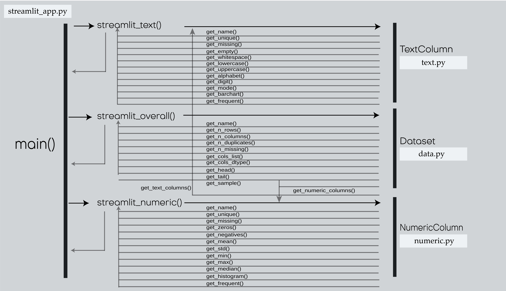

# Description

Exploratory data analysis is one of the most crucial tools in a data scientist’s life. The main purpose is to understand the dataset feature before using it for further analysis. It helps identify obvious data errors, understand the data pattern, detect outliers and discover interrelation between variables. However, it involves manual and repeated computing scripting to inspect each dataset.

This EDA web app is designed and created for streamlining the EDA process. A well-designed EDA app built using Streamlit and visualized in Docker’ container. Streamlit is an open-source Python library for building machine learning apps while Docker is an open-source containerization platform that enables developers to build, run and manage containers on servers and the cloud.

The EDA app is created by a team of three. The commit history is stored in the private source repository. Team members contribute the content and pull into Github for other team member review. The lead time for the project takes 4 weeks.

# Authors

Chitvan Bhatt, Simon Kwok, Huy Nguyen

# Structure

Our DataAnalyzer app consists of multiple files as listed below. Most of files contribute to the app, except those test files serve testing purposes in the development stage and the README file records the instruction to run the app.

Functional files
· streamlit_app.py
· data.py
· numeric.py
· text.py
· docker-compose.yml
· Dockerfile
· requirement.txt

Testing files
· test_data.py
· test_text.py
· test_numeric.py

Read file
· README.MD

#FileStructure

#Application Flow

# Instructions

To run the app:

Pre requirement:
Users need to have Docker on their computers.
https://www.docker.com/products/docker-desktop

Step:1
Clone the GitHub repository into the folder by command

> > git clone https://github.com/chitvanbhatt/DataAnalyzer.git

Step:2
For first time install, the user needs to set up the docker container by typing in the command line in the Data Analyzer folder:

> > docker-compose up

After setting up, the web application is ready to access via address: localhost:8501 in a browser.

Users can directly drag or drop files to the application, and it will automatically generate a report for their CSV file.

To close both the web app and the container:

> > docker-compose stop in another terminal or force to stop it by pressing CTRL-c

To reactivate both the web app and the container:

> > docker-compose start

To run all unittests >> python -m unittest

For Individual unittest

> > to test data.py

    python .\src\test\test_data.py

> > to test text.py

    python .\src\test\test_text.py

> > to test numeric.py

    python .\src\test\test_numeric.py
